# Marketplace : Plateforme E-commerce Multi-Vendeurs
 
Une plateforme marketplace fullstack permettant à des vendeurs de créer leurs boutiques, proposer des produits, et recevoir des paiements en ligne.

> **Stack** : Django REST Framework · Tailwind CSS · React · Redis · Stripe · Celery · Auth JWT 

---

## 📸 Screenshots

### Page d'accueil
<!-- Ajouter screenshot home -->
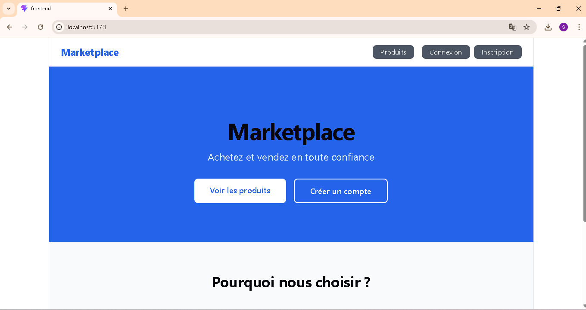
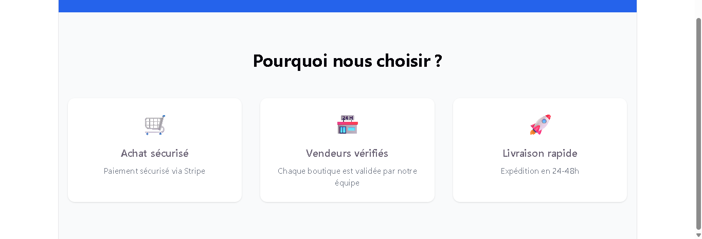

### Page Produits
<!-- Ajouter screenshot produits -->
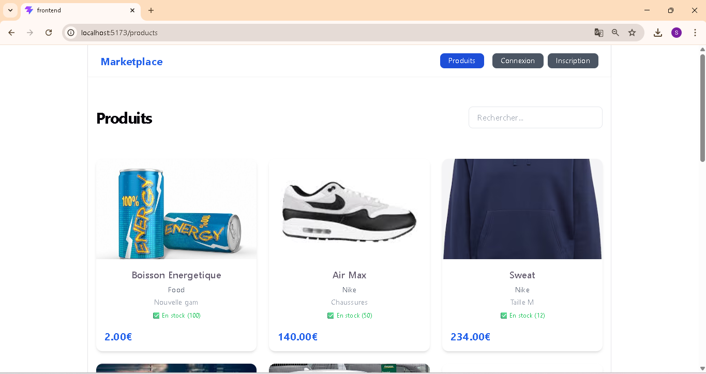
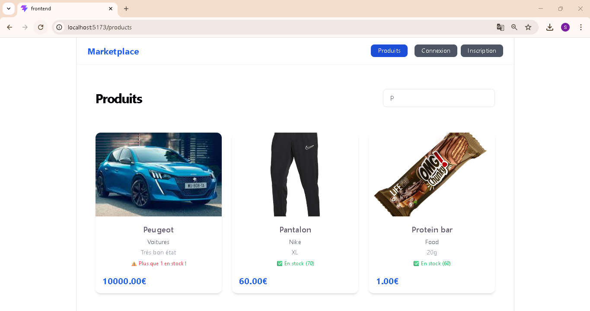

### Détail Produit
<!-- Ajouter screenshot détail produit -->
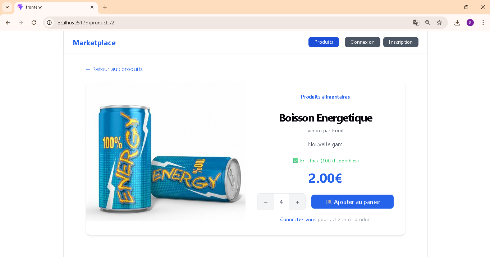

### Panier
<!-- Ajouter screenshot panier -->
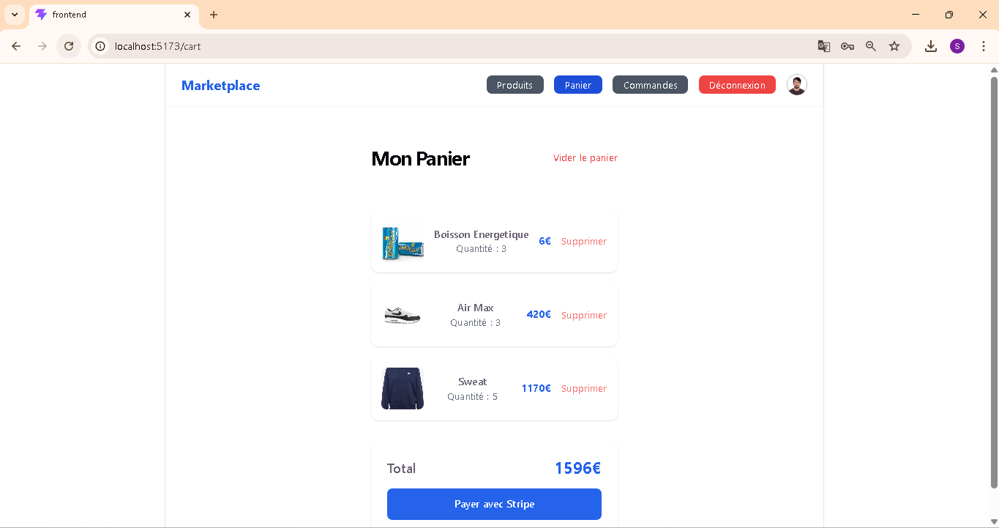

### Dashboard Vendeur
<!-- Ajouter screenshot dashboard vendeur -->
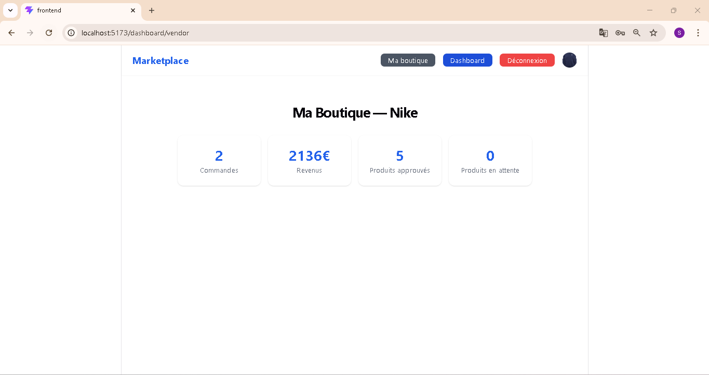

### Dashboard Modérateur
<!-- Ajouter screenshot modération -->
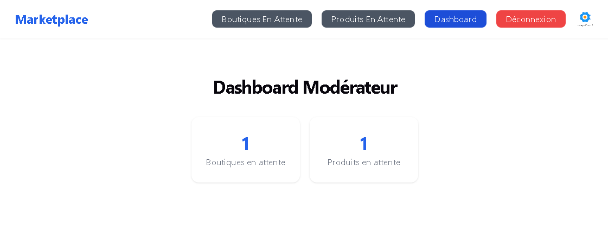

### Dashboard Admin
<!-- Ajouter screenshot admin -->
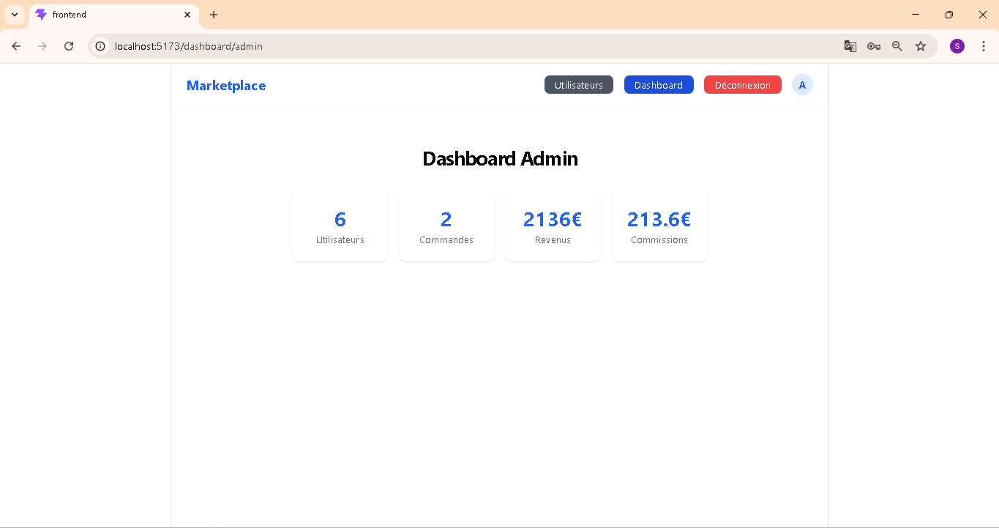

---

## 👥 Système de rôles

| Rôle | Ce qu'il peut faire |
|---|---|
| 👤 **Invité** | Parcourir les produits et boutiques |
| 🛍️ **Client** | Acheter, gérer son panier, voir ses commandes |
| 🏪 **Vendeur** | Créer sa boutique, ajouter des produits, voir ses stats |
| 🛡️ **Modérateur** | Approuver ou rejeter les boutiques et produits |
| ⚙️ **Admin** | Gérer les utilisateurs, voir les stats globales |

---

## 🗂️ Les grandes parties du projet

### 1. 🔐 Authentification
- Inscription avec choix du rôle (Client ou Vendeur)
- Connexion avec redirection automatique selon le rôle
- Tokens JWT pour sécuriser l'API
- Modification du profil et photo de profil

<!-- Ajouter screenshot login -->
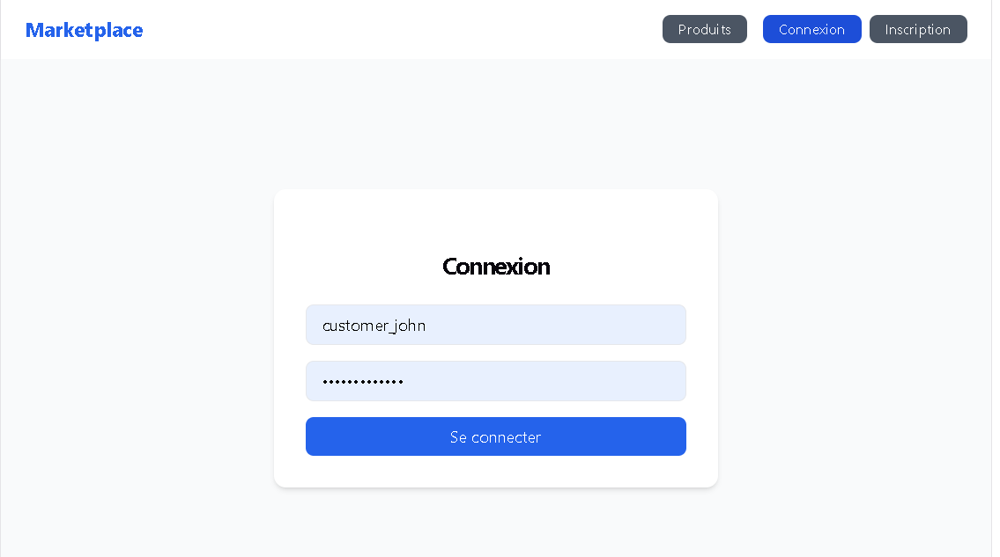
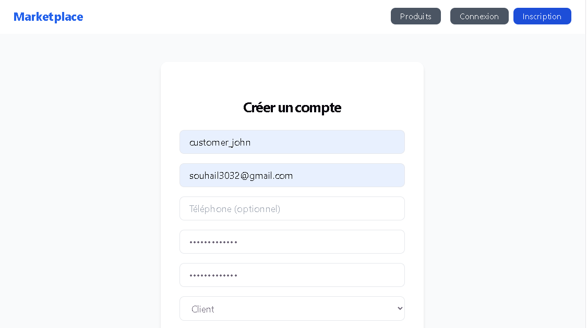

---

### 2. 🏪 Boutiques
- Un vendeur crée sa boutique après inscription
- La boutique est soumise à validation par un modérateur
- Email envoyé au vendeur lors de l'approbation ou du rejet
- Le vendeur peut modifier les infos de sa boutique à tout moment

<!-- Ajouter screenshot boutique -->
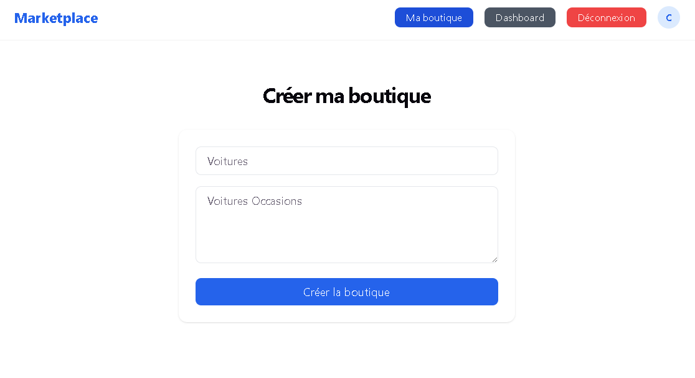

---

### 3. 📦 Produits
- Le vendeur ajoute des produits avec image, prix et stock
- Chaque produit est validé avant d'être visible publiquement
- Affichage paginé (20 produits par page) avec cache Redis
- Recherche par nom ou boutique

<!-- Ajouter screenshot produits vendeur -->
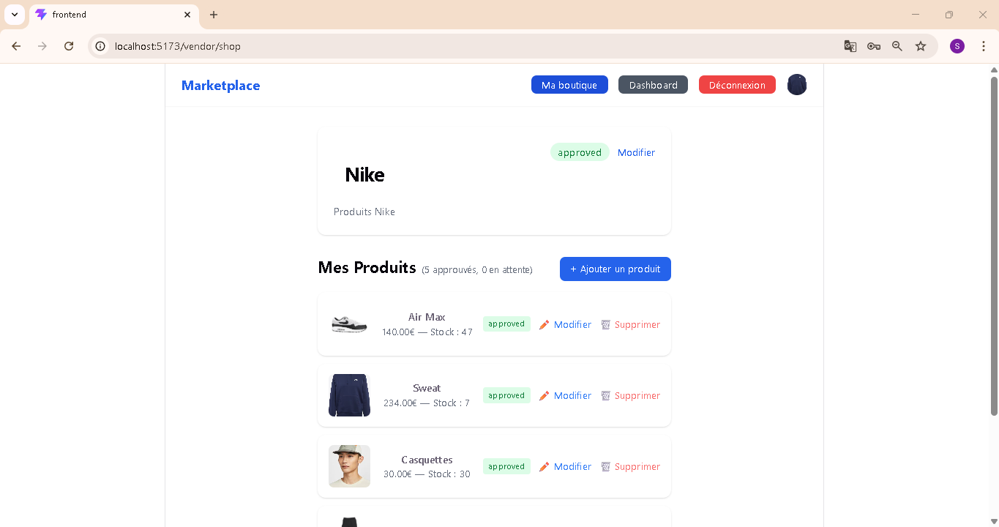

---

### 4. 🛡️ Modération
- Le modérateur voit toutes les boutiques et produits en attente
- Approbation ✅ ou rejet ❌ en un clic
- Email automatique envoyé au vendeur à chaque décision

<!-- Ajouter screenshot modération -->
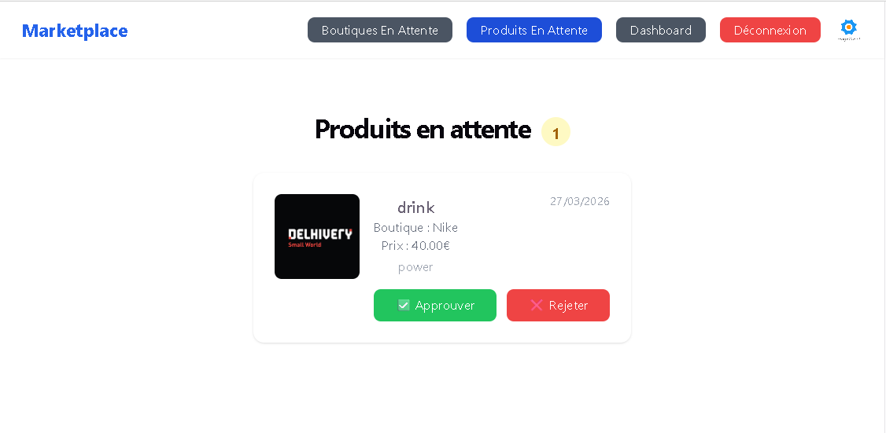
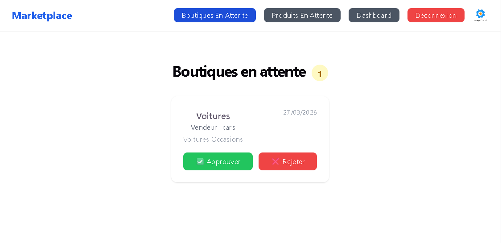

---

### 5. 🛒 Panier & Commandes
- Ajout de produits au panier avec quantité personnalisable
- Panier conservé si le paiement est annulé
- Historique des commandes payées

<!-- Ajouter screenshot commandes -->


---

### 6. 💳 Paiement Stripe
- Paiement sécurisé via Stripe
- Stock mis à jour automatiquement après paiement
- Email de confirmation envoyé après chaque achat
- Gestion des commissions marketplace

<!-- Ajouter screenshot Stripe -->
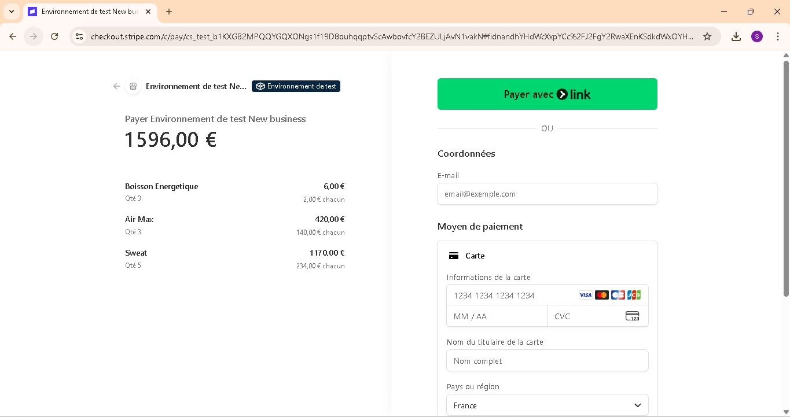

---

### 7. 📧 Notifications Email

Les emails sont envoyés automatiquement via **Celery + Redis** en arrière-plan — sans bloquer l'application.

| Événement | Destinataire | Email envoyé |
|---|---|---|
| Nouvelle boutique créée | Modérateurs | Notification de validation en attente |
| Boutique approuvée | Vendeur | Confirmation d'activation de la boutique |
| Boutique rejetée | Vendeur | Notification de rejet |
| Nouveau produit créé | Modérateurs | Notification de validation en attente |
| Produit approuvé | Vendeur | Confirmation de mise en ligne du produit |
| Produit rejeté | Vendeur | Notification de rejet |
| Paiement confirmé | Client | Email de confirmation de commande |
| Stock faible (< 5) | Vendeur | Alerte de réapprovisionnement |

<!-- Ajouter screenshot email reçu -->
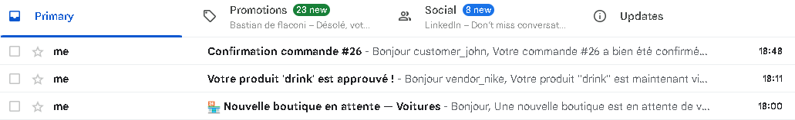


---

### 8. 📊 Dashboards
- **Vendeur** — ventes, revenus, top produits, stock
- **Modérateur** — boutiques et produits en attente
- **Admin** — utilisateurs, commandes, revenus, commissions

<!-- Ajouter screenshot dashboards -->
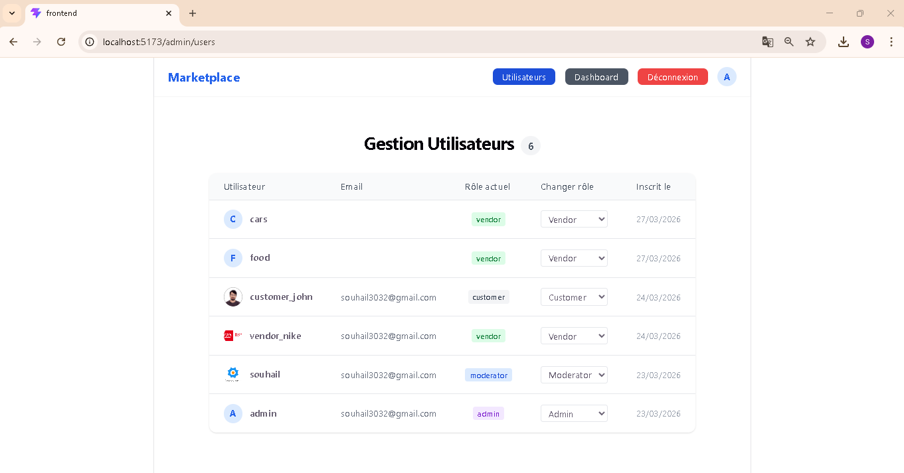

---

### 9. 👤 Profil
- Modification du nom, email, téléphone et bio
- Upload de photo de profil
- Infos du compte (rôle, date d'inscription)

<!-- Ajouter screenshot profil -->
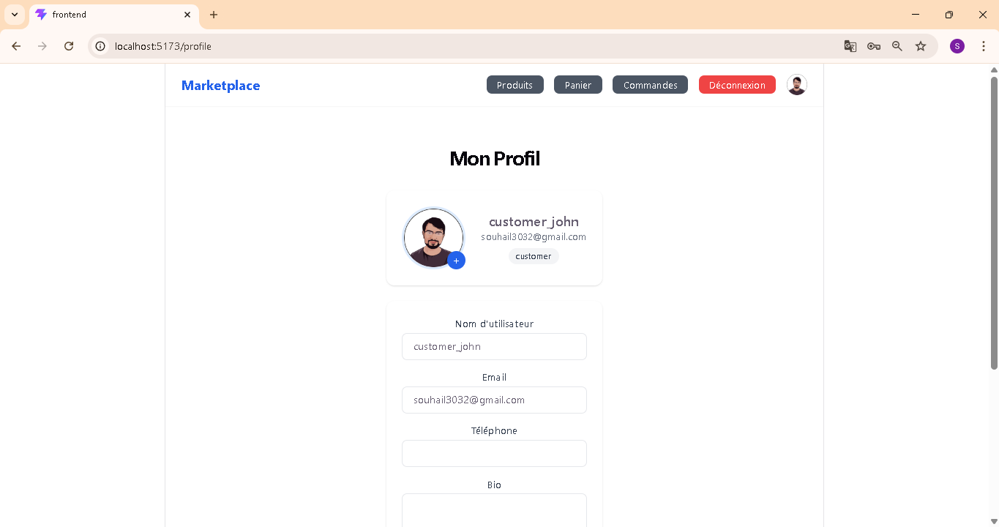

---

## 📡 Endpoints API

### Auth — `/api/auth/`

| Méthode | Endpoint | Description | Accès |
|---|---|---|---|
| `POST` | `/register/` | Inscription | Public |
| `POST` | `/login/` | Connexion → JWT | Public |
| `POST` | `/token/refresh/` | Rafraîchir le token | Public |
| `GET` | `/me/` | Infos utilisateur connecté | Connecté |
| `GET/PATCH` | `/profile/` | Voir / modifier profil | Connecté |
| `PATCH` | `/avatar/` | Modifier photo de profil | Connecté |
| `GET` | `/users/` | Liste tous les utilisateurs | Admin |
| `PATCH` | `/users/<id>/` | Changer le rôle d'un user | Admin |

---

### Boutiques — `/api/shops/`

| Méthode | Endpoint | Description | Accès |
|---|---|---|---|
| `GET` | `/` | Liste boutiques approuvées | Public |
| `POST` | `/create/` | Créer une boutique | Vendeur |
| `GET/PATCH` | `/me/` | Voir / modifier sa boutique | Vendeur |
| `GET` | `/pending/` | Boutiques en attente | Modérateur |
| `PATCH` | `/<id>/moderate/` | Approuver ou rejeter | Modérateur |

---

### Produits — `/api/products/`

| Méthode | Endpoint | Description | Accès |
|---|---|---|---|
| `GET` | `/` | Liste produits approuvés (20/page) | Public |
| `POST` | `/create/` | Ajouter un produit | Vendeur |
| `GET/PATCH/DELETE` | `/<id>/` | Gérer un produit | Vendeur |
| `GET` | `/pending/` | Produits en attente | Modérateur |
| `PATCH` | `/<id>/moderate/` | Approuver ou rejeter | Modérateur |
| `GET` | `/categories/` | Liste des catégories | Public |

---

### Commandes — `/api/orders/`

| Méthode | Endpoint | Description | Accès |
|---|---|---|---|
| `GET` | `/cart/` | Voir son panier | Client |
| `POST` | `/cart/` | Ajouter un produit au panier | Client |
| `DELETE` | `/cart/` | Vider le panier | Client |
| `DELETE` | `/cart/<id>/delete/` | Supprimer un article | Client |
| `POST` | `/checkout/` | Lancer le paiement Stripe | Client |
| `POST` | `/webhook/` | Confirmation paiement Stripe | Stripe |
| `GET` | `/` | Mes commandes payées | Client |
| `GET` | `/<id>/` | Détail d'une commande | Client |
| `GET` | `/admin/` | Toutes les commandes | Admin |

---

### Dashboard — `/api/dashboard/`

| Méthode | Endpoint | Description | Accès |
|---|---|---|---|
| `GET` | `/vendor/` | Stats du vendeur connecté | Vendeur |
| `GET` | `/admin/` | Stats globales de la plateforme | Admin |
| `GET` | `/moderator/` | Éléments en attente | Modérateur |

---

## 🧪 Tester le projet

### Comptes disponibles

```
Admin      → admin    / admin
Modérateur → souhail     / fifa12345
Vendeur    → vendor_nike   / Vendor1234
Client     → customer_john / Customer1234!
```

### Carte de test Stripe

```
Numéro : 4242 4242 4242 4242
Date   : 12/26
CVC    : 123
```

---

## ⚙️ Installation
Crée ce fichier à la racine de ton dossier backend/
```bash
# --- STRIPE (Paiements) ---
STRIPE_SECRET_KEY=sk_test_ton_code_secret
STRIPE_WEBHOOK_SECRET=whsec_ton_code_webhook
COMMISSION_RATE=0.10

# --- REDIS / CELERY ---
REDIS_URL=redis://127.0.0.1:6379/0

# --- CONFIGURATION EMAIL (SMTP) ---
EMAIL_HOST=smtp.gmail.com
EMAIL_PORT=587
EMAIL_HOST_USER=ton-adresse@gmail.com
EMAIL_HOST_PASSWORD=ton-mot-de-passe-application-google
```
Après:
```bash
# Backend
python -m venv venv
.\venv\Scripts\Activate
cd backend
pip install -r requirements.txt
python manage.py runserver

# Frontend
cd frontend
npm install
npm run dev

# Celery
celery -A config worker --loglevel=info --pool=solo

# Stripe webhook
stripe listen --forward-to localhost:8000/api/orders/webhook/
```

---

## 🚀 Mise en production


### Déploiement recommandé

| Service | Usage |
|---|---|
| **Railway** | Backend Django + PostgreSQL |
| **Vercel** | Frontend React |
| **Upstash** | Redis Cloud |
| **Cloudinary** | Stockage des images |
| **PostgreSQL** | Base de données | 

## 👤 Author

**Souhail HMAHMA** — Full Stack Developer

🌐 [souhail3.vercel.app](https://souhail3.vercel.app) · 💼 [LinkedIn](https://linkedin.com/in/souhail-hmahma) · 🐙 [GitHub](https://github.com/souhmahma)

